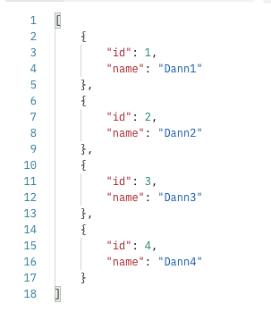
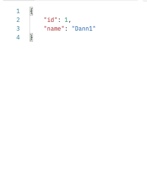

# ⭐️ API with Express Server - LaunchX

Requerimientos

```markdown

API Express Server testing all HTTP Methods

```

### Dependencies

*Dependencies*

* Express

**Scripts**

* npm start - to run express Server

### Routes

| Route             | Method | Expected          |
| ----------------- | ------ | ----------------- |
| /v1/explorers     | GET    | All Explorers     |
| /v1/explorers/:id | GET    | Specific explorer |
| /v1/explorers/    | POST   | Create explorer   |
| /v1/explorers/    | PUT    | Update explorer   |
| /v1/explorers/    | DEL    | Delete explorer   |


This endpoints are from Express API LaunchX, to test HTTP methods with test enviroment.

# End-point: localhost:3000/v1/explorers

### Method: GET

> ```
> localhost:3000/v1/explorers
> ```
>

### Body (**raw**)

```json

```

### Output

Object array with all users.



⁃ ⁃ ⁃ ⁃ ⁃ ⁃ ⁃ ⁃ ⁃ ⁃ ⁃ ⁃ ⁃ ⁃ ⁃ ⁃ ⁃ ⁃ ⁃ ⁃ ⁃ ⁃ ⁃ ⁃ ⁃ ⁃ ⁃ ⁃ ⁃ ⁃ ⁃ ⁃ ⁃ ⁃ ⁃ ⁃ ⁃ ⁃ ⁃ ⁃ ⁃ ⁃ ⁃ ⁃ ⁃ ⁃ ⁃

## End-point: localhost:3000/v1/explorers/1

### Method: GET

> ```
> localhost:3000/v1/explorers/1
> ```
>

### Output

Get user data from ID.



⁃ ⁃ ⁃ ⁃ ⁃ ⁃ ⁃ ⁃ ⁃ ⁃ ⁃ ⁃ ⁃ ⁃ ⁃ ⁃ ⁃ ⁃ ⁃ ⁃ ⁃ ⁃ ⁃ ⁃ ⁃ ⁃ ⁃ ⁃ ⁃ ⁃ ⁃ ⁃ ⁃ ⁃ ⁃ ⁃ ⁃ ⁃ ⁃ ⁃ ⁃ ⁃ ⁃ ⁃ ⁃ ⁃ ⁃

## End-point: localhost:3000/v1/explorers

### Method: POST

> ```
> localhost:3000/v1/explorers
> ```
>

### Body (**raw**)

```json
{
    "name":"dann"
}
```

### Output

Create a new explorer. Need to send data in body.


⁃ ⁃ ⁃ ⁃ ⁃ ⁃ ⁃ ⁃ ⁃ ⁃ ⁃ ⁃ ⁃ ⁃ ⁃ ⁃ ⁃ ⁃ ⁃ ⁃ ⁃ ⁃ ⁃ ⁃ ⁃ ⁃ ⁃ ⁃ ⁃ ⁃ ⁃ ⁃ ⁃ ⁃ ⁃ ⁃ ⁃ ⁃ ⁃ ⁃ ⁃ ⁃ ⁃ ⁃ ⁃ ⁃ ⁃

## End-point: localhost:3000/v1/explorers/:id

### Method: PUT

> ```
> localhost:3000/v1/explorers/1
> ```
>

### Body (**raw**)

```json
{"name":"danno"}
```

### Output

Update explorer data with specific ID.


⁃ ⁃ ⁃ ⁃ ⁃ ⁃ ⁃ ⁃ ⁃ ⁃ ⁃ ⁃ ⁃ ⁃ ⁃ ⁃ ⁃ ⁃ ⁃ ⁃ ⁃ ⁃ ⁃ ⁃ ⁃ ⁃ ⁃ ⁃ ⁃ ⁃ ⁃ ⁃ ⁃ ⁃ ⁃ ⁃ ⁃ ⁃ ⁃ ⁃ ⁃ ⁃ ⁃ ⁃ ⁃ ⁃ ⁃

## End-point: localhost:3000/v1/explorers/1

### Method: DELETE

> ```
> localhost:3000/v1/explorers/1
> ```
>

### Output

Delete explorer with specific ID.


⁃ ⁃ ⁃ ⁃ ⁃ ⁃ ⁃ ⁃ ⁃ ⁃ ⁃ ⁃ ⁃ ⁃ ⁃ ⁃ ⁃ ⁃ ⁃ ⁃ ⁃ ⁃ ⁃ ⁃ ⁃ ⁃ ⁃ ⁃ ⁃ ⁃ ⁃ ⁃ ⁃ ⁃ ⁃ ⁃ ⁃ ⁃ ⁃ ⁃ ⁃ ⁃ ⁃ ⁃ ⁃ ⁃ ⁃
